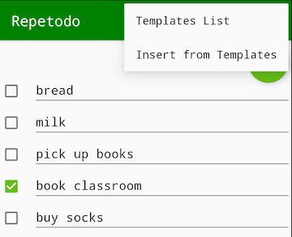

# Repetodo (Repeatable to-do list)
  

  This app helps to manage repeatable checklists. For example, everytime you go traveling, you have to remind yourself about what you should bring, such as passport, electricity adapter, umbrella, medicine,... You may make a template named "Travelling" to save all that items and just insert all items in this template into your to-do lists  

  The interface includes:
- A MainList where you can add/edit/delete tasks easily (as any other to-do apps), and insert items from templates
- A TemplatesList where you can add/edit/deleete templates. Each template contains some items.  which you may use several times (for example, travel list includes electricity adapter, passport, comb,...). You can add/edit/delete an item into/from the Template
